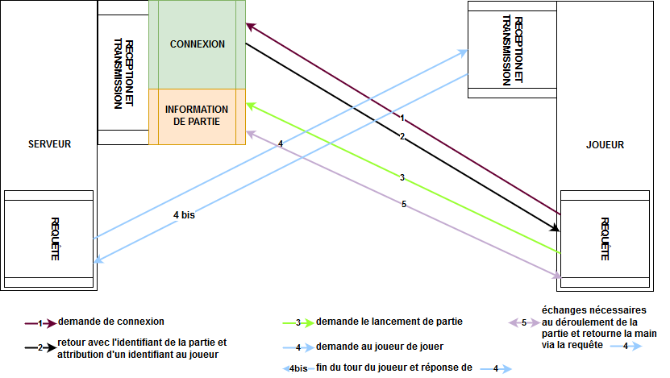

# TakenokoLan

Ci dessous un schéma de la communication serveur-joueur :

Les points à montrer :

Docker : 
    -> lancer 2 clients et 1 serveur
    Appli : 
    -> lancement en parallèle de plusieurs parties 
    -> tests de charges
    
Test :
    -> Serveur renvoie au joueur un tableau avec son Id et un Id random de partie
    

    
