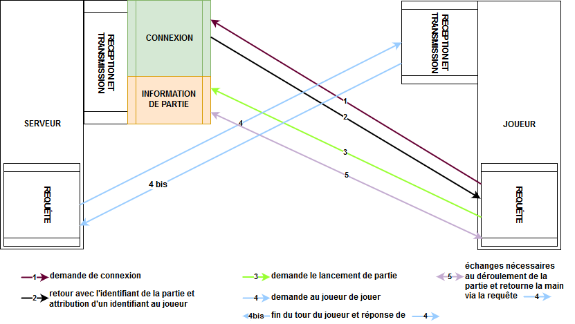

# TakenokoLan

Ci dessous un schéma de la communication serveur-joueur :

Docker : 
Pour lancer l'application dans docker :
se placer dans le dossier ProjetM1 et effectuer les commandes suivantes:
    
        mvn clean install //crée les fichiers .jar utiles
        # docker system prune -a -f && docker pull docker// attention supprime toutes vos images et containers déjà existant on doit recuperer l'image docker dans ce cas
        cd serveur
        docker build -f Dockerfile -t serveur . //crée l'image serveur
        cd ..
        cd joueur
        docker build -f Dockerfile -t joueur . //crée l'image joueur
        cd ..
        docker-compose up 
        