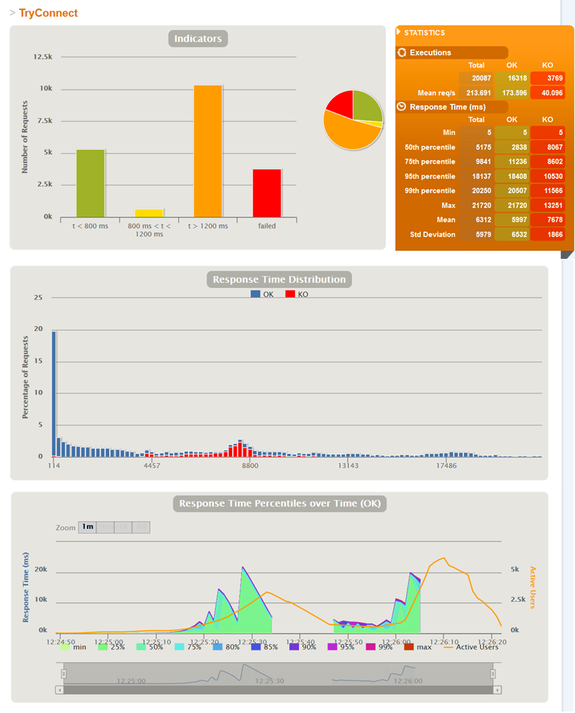
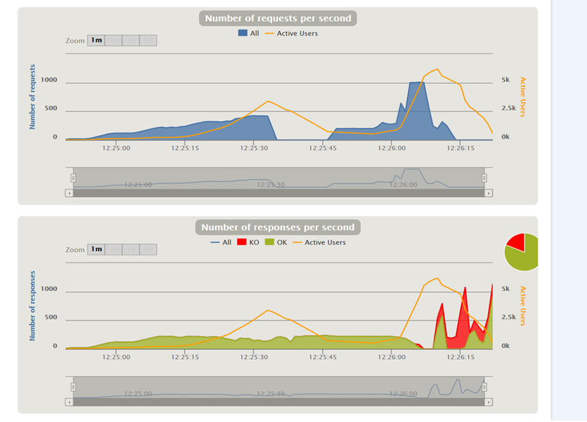

# TakenokoLan

Lancement des tests :

1ere console :

        mvn clean install
        cd serveur/target
        java -jar serveur-1.0.jar
        
2eme console :

        cd serveur
        mvn gatling:test
        
        
        

 
