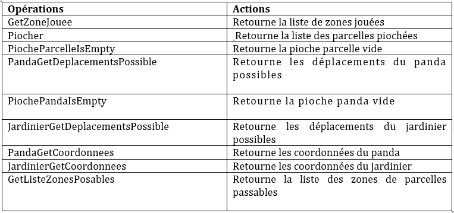
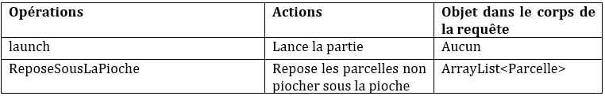
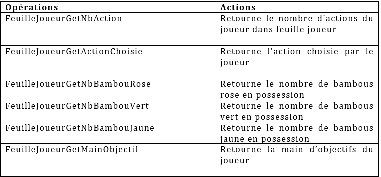
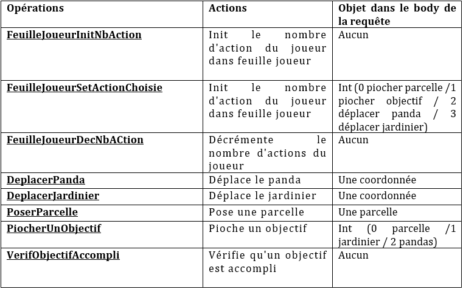

      ************************* ECHANGES SERVEUR-JOUEUR ********************************

1/ LES ROUTES IMPLEMENTEES

La communication joueur serveur est implémentée selon la figure ci-dessous :
 

   
SERVEUR:

	Etapes 1 et 2 de la Figure: échanges serveur-joueur :

Tout d’abord, nous permettons la connexion du joueur au serveur via l’url :
            
            {ipHostServeur}:8080/{Pseudo}/connect
            
Celle-ci renvoie un tableau de deux entiers :

•	le 1er :  l’identifiant de la partie 

•	le 2ème : l’identifiant du joueur voulant entrer dans la partie

	Etape 5 de la Figure: échanges serveur-joueur :

Les informations du jeu sont obtenues via l’url :

    {ipHostServeur}:8080/{identifiantPartie}/{OPERATION}

•	Opérations en GET : 

•	Opérations en POST : 

 
Les actions du jeu sont obtenues via l’url :

    {ipHostServeur}:8080/{identifiantPartie}/{identifiantJoueur}/{OPERATION}

•	Opérations en GET : 

•	Opérations en POST : 

2/ LANCEMENT DE PARTIE

JOUEUR 

	Etape 3 de la Figure:

Pour :

•	Créer un nouveau joueur

•	Connecter ce joueur au serveur

•	Demander de lancer la partie correspondante à l’identifiant ce nouveau joueur

On utilise l’url suivante :

    {ipHostJoueur}:JoueurPort }/newPlayer

	Etape 4 de la Figure 5 : échanges serveur-joueur :

Pour :

•	Chercher un joueur dans la liste des joueurs connectés

•	Le faire joueur

On utilise l’url suivante :

    {ipHostJoueur}:JoueurPort }/{identifiantPartie}/{identifiantJoueur}/joue

